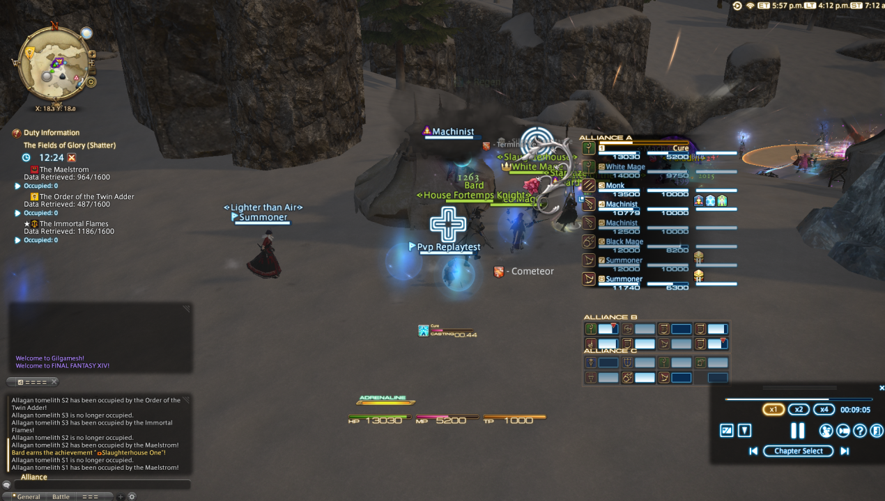

# FFXIV Recorder
This tool lets you record any duty you want, whenever you want. It's like Duty Recorder but good, and how it should have been when it was added.

## Why?
* Because Square made a huge mistake limiting the duty recording system to 1 instance in a patch cycle.
* To demonstrate that replays are not server-sided, unlike what many people seem to think.
* Maybe Square will remove the artificial limitations on the Duty Recorder
* So we can have an ["actual good duty recorder"](https://www.youtube.com/watch?v=-MlydkQQQbY&t=1h48m10s)

## Usage
Run `ffxivrecorder.exe` and use the chat commands to save recordings. Like XIV, this is always recording so you could make a recording of that absolutely fire wipe in UCOB, not that you should...

### Chat Commands
* `/frec_save <slot number>` or `/recs <slot number>`
    - Saves a replay into the file. Note that you may need to change the zone or login again to see a replay in the Duty Recorder menu.
    - Slot number is the slot that is shown in the Duty Recorder UI, it will overwrite any recording that exists in that slot.
* `/frec_chapter` or `/recc`
    - Mark current chapter as a `Countdown`.

## Special Thanks
* Adam for making this README.md
